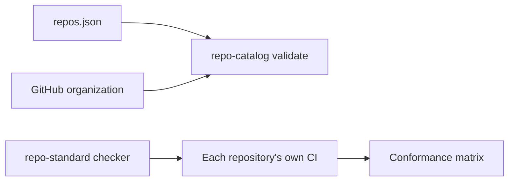

# Architecture

The catalog holds intent. [`repo-standard`](https://github.com/simpsonm09-org/simpsonm09-repo-standard)
holds the checks. Each repository runs the checks against itself.

The roster answers which repositories are in the fleet and what tier each one holds.
`ignore.json` records the repositories that are deliberately out of the fleet, with a
reason. The validator fails when the roster and the organization disagree, so a new
repository must be cataloged or explicitly ignored. Conformance is not the catalog's
job. Each repository checks itself against the standard. See
[`repo-standard`](https://github.com/simpsonm09-org/simpsonm09-repo-standard) for the checks.
