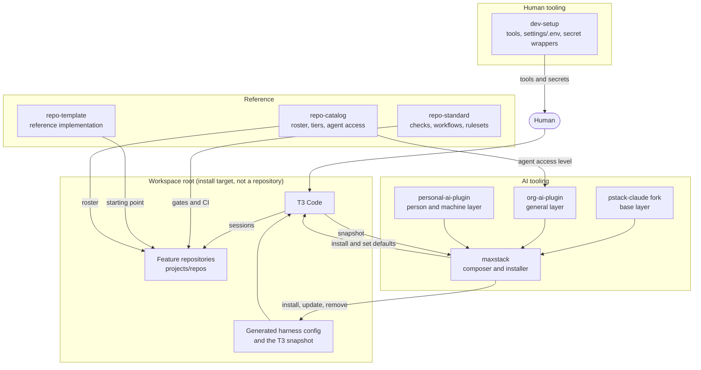
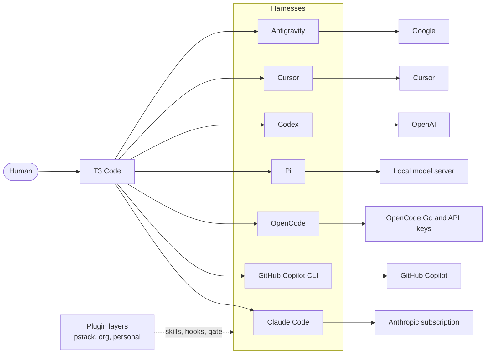
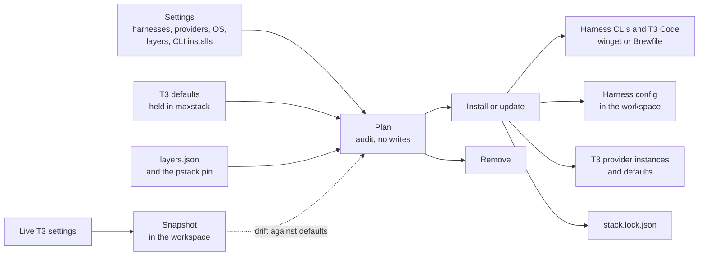

# Fleet architecture

This page is the guiding document for the fleet. It names the four groups of repositories, what each group owns, and how a person reaches a model through the workspace. It states the target. The last section lists where the fleet differs from the target today.

`<workspace>` means the workspace root. It is an install target, not a repository. Every clone lives under `<workspace>/projects/repos`, and every linked worktree lives under `<workspace>/projects/worktrees`.

## The four groups

| Group | Repositories | Answers |
| --- | --- | --- |
| AI tooling | `simpsonm09-maxstack`, `pstack-claude` (fork), `simpsonm09-org-ai-plugin`, `simpsonm09-personal-ai-plugin` | How does an agent session get its harness, its skills, and its rules? |
| Human tooling | `simpsonm09-dev-setup` | Which tools does the person have, and how does a command get a secret? |
| Reference | `simpsonm09-repo-standard`, `simpsonm09-repo-catalog`, `simpsonm09-repo-template` | What is in the fleet, what does "done" mean, and what may an agent do? |
| Feature | Every other repository | What does the fleet build? |

## The path from a person to a model

A person works in T3 Code. T3 Code starts one of seven harnesses. The harness talks to a model provider, and the provider path differs by harness. maxstack sets no model. The person picks the model in the T3 model picker.

Claude Code stays on the Anthropic subscription, and Copilot stays on GitHub. OpenCode serves OpenCode Go and API keys. Pi serves local models only, through a llama.cpp server on the same machine. Pi is the validation harness. It carries no third-party Pi extensions. It loads only the org gate and pstack's own Pi extension.

The three plugin layers load in order, and a later layer wins where two layers set the same value.

1. `pstack` is the base layer. It comes from the `plugins/pstack` folder of the `pstack-claude` fork at one pinned commit.
2. `simpsonm09-org-ai-plugin` is the general layer. It holds the skills, the integration registry, and the tool-call gate that apply to any person or machine.
3. `simpsonm09-personal-ai-plugin` is the person and machine layer. It holds the skills that name one person's accounts and one machine.

One layer is one plugin in every harness. Edit a layer in its own repository, never in an installed copy.

## AI tooling

### maxstack

maxstack composes the AI stack and owns its lifecycle in a workspace. It owns no layer. Its inputs are one settings file and the ordered layer manifest. Its output is a workspace that a person can open in T3 Code.

maxstack has six jobs.

| Job | What it means |
| --- | --- |
| Hold the T3 defaults | The T3 Code setup the fleet wants lives in maxstack as a file. The defaults file names the provider instances and the app defaults. It sets no model. The T3 settings keys `defaultModelSelection` and `textGenerationModelSelection` are left to the person. It holds no secret and no machine path. |
| Generate a workspace | Given a target directory, maxstack installs T3 Code, then applies either the T3 defaults or the maxstack defaults. The target is an argument, not a fixed path. |
| Set up the harnesses | For each harness the settings select, maxstack writes the config that harness needs on this OS: plugin folders, wrappers, agent folders, and the matching T3 provider instance. A harness the settings leave out gets nothing. |
| Install the CLIs | maxstack installs T3 Code and each selected harness CLI with the OS package manager. It uses winget on Windows and a Brewfile on macOS. |
| Manage its own lifecycle | Install, update, and remove are one command with one plan. Each run converges on the same end state, so a second run changes nothing. Remove deletes only what the lock file records. Update applies a change in the settings, the layers, or the pin. |
| Snapshot T3 | maxstack reads the live T3 settings and writes a snapshot into the workspace. The snapshot excludes logins, tokens, and session history. A diff of the snapshot against the defaults is the drift report. |

The workspace rule follows from these jobs. Settings live in the workspace, not in a global folder. When a tool only reads a global file, maxstack keeps the wanted value in the repository, keeps the observed value in the workspace snapshot, and reports the difference.

### The layers

| Repository | Owns | Does not own |
| --- | --- | --- |
| `pstack-claude` (fork) | The PStack plugin for every harness: skills, playbooks, hooks, and agent profiles. | The pin. maxstack holds it. |
| `simpsonm09-org-ai-plugin` | General skills, the integration registry, and the gate that enforces the catalog's agent access level. | Any value that names a person, an account, or a machine. |
| `simpsonm09-personal-ai-plugin` | The personal concretes: accounts, identities, and personal services. | A secret value. It says where a value comes from. |

`pstack-claude` is a fork of a third-party repository. Changes stay on the fork. No pull request goes to a repository the organization does not own.

## Human tooling

`simpsonm09-dev-setup` is for the person, not the agent. It has two jobs.

- **Tooling.** It installs the tools a person uses on a machine and applies their app settings. `tools.yaml` is the one hand-edited source, and the Brewfile and the winget list render from it.
- **Secrets consumption.** It owns `settings/.env` and the wrappers that hand a secret to one command. `with-secrets <tool>` is the human path. `with-vault --role human|agent <tool>` is the brokered path, where the tool never holds the token.

`.envrc` is retired for now. A secret reaches a command through a wrapper, not through a shell that loaded everything on entry. `settings/.env` stays, with its committed `settings/.env.example`, so the bootstrap values and the list of expected names survive. The `.env` file holds only what unlocks the secret store plus a small offline fallback, and it is never committed.

The boundary with maxstack is the harness. maxstack installs T3 Code and the harness CLIs. dev-setup installs everything else.

## Reference

The three reference repositories describe the fleet. They do not run it.

| Repository | Answers | Holds |
| --- | --- | --- |
| `simpsonm09-repo-catalog` | What is in the fleet, and what may an agent do in each repository? | The roster, the tiers, and the agent access levels. |
| `simpsonm09-repo-standard` | What is best practice, and what does "done" mean? | The per-language lint and test rules, the reusable GitHub Actions workflows, the rulesets, and the conformance checker. |
| `simpsonm09-repo-template` | What does a conforming repository look like? | A working reference implementation to start a new repository from. |

The catalog holds intent, and the standard holds checks. Each repository runs the checks against itself in its own CI. No repository audits another.

Agent access is one value per repository: `none`, `read`, `propose`, `merge`, or `full`. The catalog sets a default per tier, and a repository may override it. The org layer's gate reads the level and applies it to each tool call in every harness that can run a pre-tool hook. See [`policy.md`](../policy.md).

## Feature

Every repository outside the three groups above is a feature repository. It consumes the standard, starts from the template, and appears in the roster. It owns no fleet rule.

| Kind | Repositories | Note |
| --- | --- | --- |
| Feature | `simpsonm09-browser-calculator`, `simpsonm09-postman-test-utils`, `simpsonm09-playwright-api-wrapper`, `simpsonm09-pokeapi-wrapper`, `simpsonm09-openclaw-homelab` | Products. |
| Fixture | `simpsonm09-fixture-nest`, `simpsonm09-fixture-go`, `simpsonm09-fixture-rust`, `simpsonm09-fixture-dotnet` | One per agent access level. They validate the framework and are not products. |
| Tooling data | `simpsonm09-machine-inventory` | Read by the org layer. |
| Third-party forks | `t3code`, `cursor-plugins`, `Win-CodexBar` | Kept for reference and local patches. Outside the roster, and never a pull request target upstream. |

## Where a change goes

| The change | Repository |
| --- | --- |
| A skill, playbook, or hook that applies to any PStack user | `pstack-claude` fork |
| A skill, registry entry, or gate rule that applies to anyone in the fleet | `simpsonm09-org-ai-plugin` |
| An account, identity, or personal service | `simpsonm09-personal-ai-plugin` |
| Layer order, the pstack pin, a harness, a T3 default, a harness CLI install | `simpsonm09-maxstack` |
| A human tool, an app setting, a secret name, a wrapper | `simpsonm09-dev-setup` |
| A lint rule, a workflow, a ruleset, the definition of done | `simpsonm09-repo-standard` |
| A new repository, a tier, an agent access level | `simpsonm09-repo-catalog` |
| What a new repository starts with | `simpsonm09-repo-template` |
| Product behavior | The feature repository |

## Gaps as of 2026-10-10

Each row is a difference between the target above and what the repositories hold today. Move a row to the owning repository's roadmap when work starts.

| Target | Today | Owner |
| --- | --- | --- |
| Seven harnesses composed | `layers.json` composes four: Claude Code, Copilot, OpenCode, and Pi. T3 Code has instances for Codex, Cursor, and Antigravity, and maxstack writes nothing for them. | maxstack |
| T3 defaults held in maxstack | The instances are a table in `docs/t3-setup.md` and are set by hand. | maxstack |
| T3 snapshot in the workspace | T3 settings live in the user profile. The dev-setup snapshot records only whether that folder exists. | maxstack |
| maxstack installs T3 Code and the harness CLIs | `tools.yaml` in dev-setup lists `t3-code`, `opencode`, and `claude-code`. The Brewfile also lives in dev-setup. | maxstack, dev-setup |
| Workspace generated at any target | The installer takes a `-Workspace` argument, but its default is still one fixed path. | maxstack |
| One lifecycle command on every OS | The installer is PowerShell. It has `-Apply`, `-Status`, `-Remove`, and `-Uninstall`, and it selects runtimes and layers with `-Runtimes` and `-Layers`. Per-layer sources are set with `-LayerSource` on `main`, and as `-Source` on `feat/update-sources`. `-Update` and `-Update -Check` are in review on maxstack branch `feat/update-sources`. The macOS wrappers are untested. | maxstack |
| `.envrc` retired | The workspace root has an `.envrc`, dev-setup ships `settings/.envrc.example`, and both repositories' docs call it the secret-loading boundary. These files also need a follow-up when `.envrc` is retired: org-ai-plugin `skills/local-services` and `skills/service-integrations`, personal-ai-plugin `skills/dev-tools` and `skills/integrations-personal`, and maxstack `docs/relationship.md`. | dev-setup |
| Roster matches the groups | `repos.json` lists `pstack-opencode-plugin` as a plugin layer. The pstack layer now comes from the `pstack-claude` fork. | repo-catalog |
| Each model path is in the ownership record | The local model server and its Pi provider file are not owned by maxstack's ownership record yet. | maxstack |
| The gate runs in every harness that can run a pre-tool hook | The gate runs in Claude Code, Copilot, OpenCode, and Pi only. There is no gate on Codex, Cursor, or Antigravity. See G1 in the [parity matrix](https://github.com/simpsonm09-org/simpsonm09-maxstack/blob/main/docs/parity-matrix.md). | org-ai-plugin, maxstack |
| pstack's own pre-tool checks run on every OS | The Copilot PreToolUse hook is a no-op stub on Windows for pstack's own checks, so the file-read and subagent-model checks do not run there. See G2 in the [parity matrix](https://github.com/simpsonm09-org/simpsonm09-maxstack/blob/main/docs/parity-matrix.md). | org-ai-plugin, maxstack |
| The gate fails closed on every path | The gate has paths that fail open silently. Claude allows a call when its hook is killed at the timeout, and a call runs with no gate and no error when `node` is not on the hook shell's PATH. See G3 in the [parity matrix](https://github.com/simpsonm09-org/simpsonm09-maxstack/blob/main/docs/parity-matrix.md). | org-ai-plugin, maxstack |
| The gate's live path is proven on every harness that runs it | The OpenCode gate path is not proven end to end. OpenCode rewrites a denied command and does not block it, and the rewrite is not measured live. See G4 in the [parity matrix](https://github.com/simpsonm09-org/simpsonm09-maxstack/blob/main/docs/parity-matrix.md). | org-ai-plugin, maxstack |

**Sequence.** The work runs in this order. The update and per-layer sources work comes first. Then come the settings file and a workspace at any target, then the read-only T3 snapshot and the drift report. Harness CLI installs follow, with ownership. maxstack records only the CLIs it installed, and it never removes a CLI the person installed. macOS and the generator come next. The generator covers skills, instructions, and MCP first, then agents and hooks. Cursor is the first new harness.

## Open decisions

- **Where the T3 snapshot lives.** T3 Code reads its settings from the user profile. Either maxstack copies an allowlisted snapshot into the workspace, or T3 Code is pointed at a workspace folder if it supports that. The first works today.
- **How `tools.yaml` splits.** Either the harness entries move to maxstack, or maxstack reads them from dev-setup. Moving them keeps the rule that the two manifests never read each other.
- **Whether WSL keeps a loader.** Without `.envrc`, a WSL shell loads nothing on entry. The wrappers cover single commands. A long-lived server that needs a secret needs another answer.
